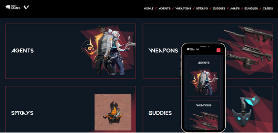

<h1 align="center"> Guide - Valorant </h1>

  

 

  

## 🚀 Tecnologias

Esse projeto foi desenvolvido com as seguintes tecnologias:

- react (v18.2.0)
- react-router-dom (v6.23.0)
- chakra-ui/react (v2.8.2)
- chakra-ui/icons (v2.1.1)
- API Valorant (https://valorant-api.com/)
- Git e Github

## 💻 Projeto

Tem o intuito de colocar em pratica meus conhecimentos adquiridos em ReactJS consumindo uma API.

## :memo: Licença

Esse projeto está sob a licença MIT.